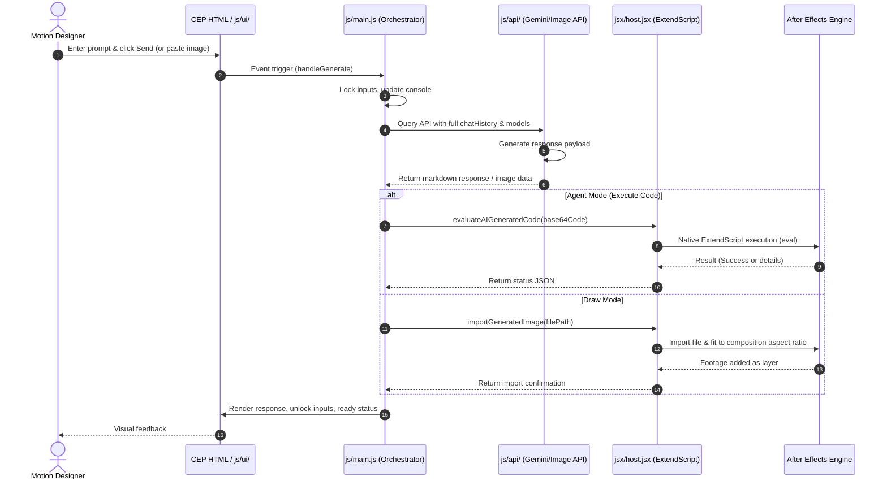

# Gemini AE Assistant Architecture

This document describes the design system and modular directory structure of the **Gemini AE Assistant** Adobe After Effects extension.

The extension has been fully refactored from a single monolithic file into a clean, modular architecture. This separation improves code readability, enhances testability, and supports scaling future AI automation features without breaking core functionality.

---

## Directory Overview

```
GeminiAEAssistant/
├── ARCHITECTURE.md          # This documentation file
├── index.html               # Main UI Layout & Script imports
├── css/
│   └── style.css            # Styling & premium modern theme variables
├── js/
│   ├── main.js              # Entry-point & orchestration layer
│   ├── config.js            # Configuration, API keys, models & prompts
│   ├── CSInterface.js       # Adobe CEP Communication library
│   ├── ae/
│   │   └── bridge.js        # CEP-to-ExtendScript execution & logs
│   ├── api/
│   │   ├── gemini.js        # Gemini Text/Code API Client
│   │   └── imageGen.js      # Pollinations AI & Google Imagen Image Gen
│   └── ui/
│       ├── attachments.js   # Image paste, previews & upload flow
│       ├── console.js       # Log updates, status bar & context limits
│       ├── renderer.js      # Markdown parse, code blocks & copy buttons
│       └── modes.js         # Mode selectors (Agent, Ask, Draw) & dropdowns
└── jsx/
    └── host.jsx             # After Effects ExtendScript runtime routines
```

---

## Architectural Principles

1. **No Bundlers / Native Loading**: Because Adobe CEP runs a standard Chromium context directly without automatic build-step integration (Webpack/Vite), files are loaded sequentially as traditional `<script>` tags in `index.html`.
2. **Global State Communication**: Modules interact cleanly via global variables initialized in the browser context (e.g. `csInterface`, `chatHistory`, `attachedFiles`, `isGenerating`).
3. **ExtendScript Isolation**: Standard CEP frontend code cannot directly control After Effects comps. It sends requests via the `csInterface.evalScript()` bridge to `/jsx/host.jsx`, which executes scripts natively within the ExtendScript engine.

---

## Detailed Module Descriptions

### 1. Root Orchestration
*   **[main.js](file:///Users/tolik/Library/Application%20Support/Adobe/CEP/extensions/GeminiAEAssistant/js/main.js)**: 
    *   Initializes the extension once the DOM loads.
    *   Captures user input and key bindings (Enter key to submit, F5/Ctrl+R to reload).
    *   Acts as the central router for user requests (`handleGenerate`), dispatching tasks to `imageGen.js` (for Draw mode) or `gemini.js` (for Agent/Ask modes).

### 2. Configuration & Prompts
*   **[config.js](file:///Users/tolik/Library/Application%20Support/Adobe/CEP/extensions/GeminiAEAssistant/js/config.js)**:
    *   Stores core settings, including Gemini API keys (`API_KEY`, `IMAGEN_API_KEY`).
    *   Configures list of supported models (`MODELS` and `IMAGE_MODELS`).
    *   Defines system guidelines and strict programming prompts for both the code generation model and the chat assistant.

### 3. API Clients
*   **[api/gemini.js](file:///Users/tolik/Library/Application%20Support/Adobe/CEP/extensions/GeminiAEAssistant/js/api/gemini.js)**:
    *   Constructs payloads and executes fetch requests to the Gemini developer API.
    *   Handles code blocks, contextual parameters, and parses generation streams.
*   **[api/imageGen.js](file:///Users/tolik/Library/Application%20Support/Adobe/CEP/extensions/GeminiAEAssistant/js/api/imageGen.js)**:
    *   Handles image generation requests from the Draw tab.
    *   Supports dynamic Google Imagen models and a free Pollinations AI FLUX model fallback.
    *   Appends isolated background modifiers (chroma keying) in *Isolated Asset* mode, saves output images to disk, and triggers active composition layers.

### 4. UI Layer
*   **[ui/modes.js](file:///Users/tolik/Library/Application%20Support/Adobe/CEP/extensions/GeminiAEAssistant/js/ui/modes.js)**:
    *   Binds event handlers to the headers tabs (Agent / Ask / Draw).
    *   Shows/hides corresponding input modifiers (e.g. Aspect ratio controls or key background color pills).
    *   Dynamically updates dropdowns depending on active mode and resolves online model availability.
*   **[ui/attachments.js](file:///Users/tolik/Library/Application%20Support/Adobe/CEP/extensions/GeminiAEAssistant/js/ui/attachments.js)**:
    *   Monitors attachment action buttons and handles image inputs.
    *   Implements native clipboard-paste handlers for image data.
    *   Resizes high-resolution attachments dynamically to optimize payload size and avoid API quota bottlenecks.
*   **[ui/renderer.js](file:///Users/tolik/Library/Application%20Support/Adobe/CEP/extensions/GeminiAEAssistant/js/ui/renderer.js)**:
    *   A lightweight, custom Markdown parser that renders formatting, paragraphs, lists, and inline styles into high-performance HTML.
    *   Highlights code blocks and attaches interactive copy-to-clipboard click handlers.
*   **[ui/console.js](file:///Users/tolik/Library/Application%20Support/Adobe/CEP/extensions/GeminiAEAssistant/js/ui/console.js)**:
    *   Orchestrates logging into the expandable Developer Drawer.
    *   Calculates and visualizes approximate active model token limits via a radial progress bar.

### 5. ExtendScript Host Interface
*   **[ae/bridge.js](file:///Users/tolik/Library/Application%20Support/Adobe/CEP/extensions/GeminiAEAssistant/js/ae/bridge.js)**:
    *   Funnels base64 encoded scripts directly to the After Effects application engine.
    *   Saves active session transactions to a persistent local text file (`Gemini_AE_Script_Log.txt`) in the Documents folder for inspection.
*   **[host.jsx](file:///Users/tolik/Library/Application%20Support/Adobe/CEP/extensions/GeminiAEAssistant/jsx/host.jsx)**:
    *   Executes inside After Effects' ExtendScript ecosystem.
    *   Provides high-level APIs to evaluate scripts, retrieve active composition sizes/aspect ratios, and import AI-generated layers with automatic proportional scale matching.

---

## Data & Event Flow



---

## Import Order Constraints

Because the modules share globals, they **must** be loaded in `index.html` in the correct dependency order. The main script must load last:

1.  `CSInterface.js` (Core SDK)
2.  `config.js` (Constants & prompt definitions)
3.  `ui/console.js` (Logging, status indicators)
4.  `ui/renderer.js` (Markdown and copying)
5.  `ui/attachments.js` (Paste, resize)
6.  `ui/modes.js` (Tabs and model select dropdowns)
7.  `ae/bridge.js` (ExtendScript execution helper)
8.  `api/gemini.js` (Gemini text model fetching)
9.  `api/imageGen.js` (Gemini/Pollinations image drawing)
10. `main.js` (Entry point, event bindings)

---

## 🛠️ Git & Development Workflow

To maintain a professional, clean, and highly stable codebase, the project follows a strict branch-based isolation strategy. Direct commits to `main` are reserved only for integration and final verified releases.

### 🌿 Branch Classifications

*   🎨 **`design`**: Dedicated strictly to UI, UX, vanilla CSS styling, layout modifications, theme variables, glassmorphic styles, and micro-animations.
*   📱 **`telegram-remote-control`**: Dedicated to implementing, debugging, and refining Telegram Bot remote integration, remote execution, screen capturing, and remote model switching.
*   🐞 **`debugging`**: Dedicated to diagnostics, console logs, error boundary refinements, performance monitoring, and hot-reload adjustments.
*   🚀 **`features/`**: The standard prefix for introducing any entirely new application modules, capabilities, or user workflows (e.g., custom preset managers).

### 🔄 Integration Flow (Minimalist & Professional)

1.  **Isolate**: Always switch to the respective branch matching the scope of your edits (`git checkout design`, `git checkout telegram-remote-control`, etc.).
2.  **Verify**: Perform manual and automated tests locally in After Effects to ensure zero runtime regressions.
3.  **Merge & Commit**: Merge development branches into `main` and draft a descriptive, minimalist commit message.
4.  **Publish**: Push verified changes up to the remote repository.

---

### 🤝 Правила совместной работы агентов (Agent Cooperation & Concurrency Policy)

Для исключения конфликтов при параллельной работе нескольких ИИ-агентов (Cursor, Windsurf, Antigravity) в одном проекте:

1. **Блокировка файлов (File Locking)**: Агенту запрещено редактировать файл или конкретную функцию, если над этим же компонентом параллельно ведет работу другой агент.
2. **Изоляция по веткам (Branch Isolation)**: Параллельные задачи должны выполняться строго на соответствующих ветках (`design`, `telegram-remote-control`, `debugging`, `features/`). Редактирование одного файла на разных ветках одновременно не допускается.
3. **Проверка состояния (Pre-edit Check)**: Перед любым изменением агент обязан выполнить `git status` или проверить дифф, чтобы убедиться, что файл не был изменен внешним процессом в процессе сессии.
4. **Координация пользователем (User Orchestration)**: Пользователь выступает главным арбитром блокировок. Утверждение кода командами (`apply`/`agreed`) происходит последовательно, по очереди для каждого агента.
